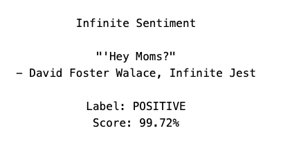
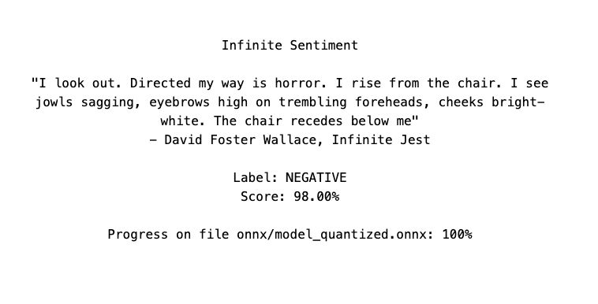

# Infinite Sentiment

## About:

I wanted to try out Hugging Face's Transformers.js ([https://huggingface.co/docs/transformers.js/index](https://huggingface.co/docs/transformers.js/index)) machine learning library on random quotes and I had a text file of Infinite Jest by David Foster Wallace, hence this Infinite Sentiment app which when run will display a random paragraph from Infinite Jest and then run Transformer's `Xenova/distilbert-base-uncased-finetuned-sst-2-english` text-classification model on the paragraph which provides a sentiment label and score for it.

Right now, on load the app parses the entirety of an Infinite Jest text file and then displays one random paragraph which it passes to Transformers.js library to await and then display the sentiment classification. In the future it would behoove me to add a button to pull other paragraphs from the already parsed text (indeed, it wouldn't be too hard to add additional, related functionality like scrolling through adjacent paragraphs, etc). However, as it stands right now, if you want to display a different random paragraph you can just refresh the page. Although it is a lot of text to parse, the time it takes is unnoticeable. It's actually the machine learning that takes some time as you'll see based on the loading text.

## Play with it:

[https://github.com/unitof](https://github.com/unitof) deployed this app here: [https://infinitesentiment.vercel.app/](https://infinitesentiment.vercel.app/)! Thank you :)

## Running this app locally is easy:

This is a [Next.js](https://nextjs.org/) project.

First, run the development server:

```bash
# download the repo
git clone git@github.com:cipherphage/Infinite-Sentiment.git
# change directories
cd Infinite-Sentiment/
# install the dependencies using your choice of package manager
npm install
# then run it locally in development mode
npm run dev
```

Second, open [http://localhost:3000](http://localhost:3000) with your browser to see the result.

That's it!

Note: this app runs entirely client-side and runs machine learning models right in the browser. The local Next.js server is only used to serve the client-side code.

## Sample pictures of the simple UI:





## Bugs

- Browser caching has been turned off in transformers.js (`env.userBrowserCache = false`), because transformers.js is having an issue handling 404 responses when fetching model files in the Brave browser. I commented on their Github repo and also made a StackOverflow post:
  - [https://github.com/xenova/transformers.js/issues/366](https://github.com/xenova/transformers.js/issues/366)
  - [https://stackoverflow.com/questions/77614213/transformer-js-model-fails-to-parse-json-in-client-side-next-js-example/77614214#77614214](https://stackoverflow.com/questions/77614213/transformer-js-model-fails-to-parse-json-in-client-side-next-js-example/77614214#77614214)
  - Note: this doesn't seem to be a problem on the latest version of Chrome I tried, `Version 120.0.6099.62 (Official Build) (x86_64)`, only on Brave: `Version 1.61.101 Chromium: 120.0.6099.71 (Official Build) (x86_64)`.
  
- The text in `public/ij.txt` is not well formatted and contains inappropriate linebreaks through-out. I use a simple regex to parse it and put the passages into an array, then randomly pull one element out of the array. While this is not exactly a bug, it's all very rough and inconsistent and in need of refinement, both in terms of the text and the parser. This is the regex:
  - `/[.!'"?](?=[\s]+[\n]+[\s]+)/g`

## Fixes

- FIXED 12.07.23: consecutive letters that are the same are dropped before rendering on the page. For example, the sentence:<br> 
    `The letters here, when React state is called on them, would not all appear on screen`<br>
would get rendered on the page as:<br>
    `The leters here, when React state is caled on them, would not al apear on scren` 
