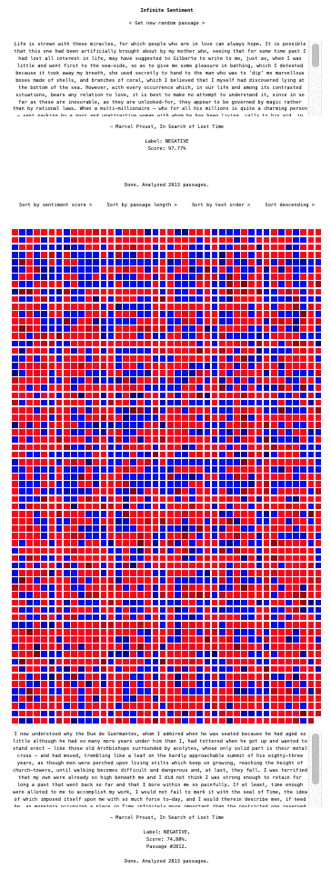
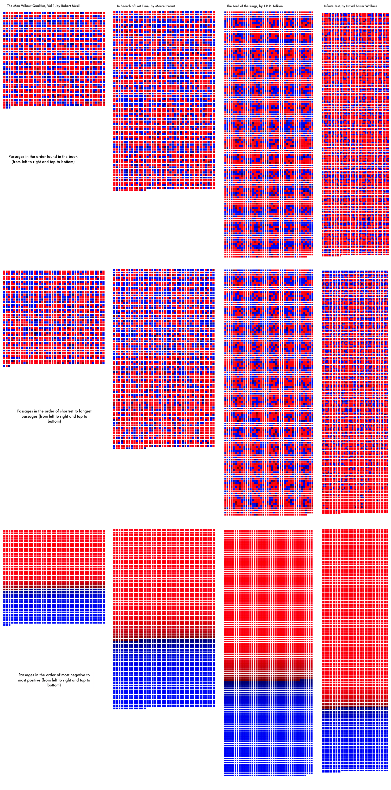

# Infinite Sentiment

## About:

I wanted to try out Hugging Face's Transformers.js ([https://huggingface.co/docs/transformers.js/index](https://huggingface.co/docs/transformers.js/index)) machine learning library on random quotes and I had a text file of Infinite Jest by David Foster Wallace, hence this Infinite Sentiment app which when run will display a random paragraph from Infinite Jest and then run Transformer's `Xenova/distilbert-base-uncased-finetuned-sst-2-english` text-classification model on the paragraph which provides a sentiment label and score for it.

On a branch called `sentiment-viewer` I've started building a more generalized application that creates a heat map based on the sentiment scores of all of the passages from any given text (see pictures below). This remains a work-in-progress, but I have a comparison chart showing how it can be useful to compare different texts by sorting the passages based on sentiment or passage length, not only on the order in which they appear in the works of literature.

## Play with it:

[https://github.com/unitof](https://github.com/unitof) deployed what's on `main` here: [https://infinitesentiment.vercel.app/](https://infinitesentiment.vercel.app/)! Thank you :)

## Running this app locally is easy:

This is a [Next.js](https://nextjs.org/) project.

First, run the development server:

```bash
# download the repo
git clone git@github.com:cipherphage/Infinite-Sentiment.git
# change directories
cd Infinite-Sentiment/
# install the dependencies using your choice of package manager
npm install
# then run it locally in development mode
npm run dev
```

Second, open [http://localhost:3000](http://localhost:3000) with your browser to see the result.

That's it!

Note: this app runs entirely client-side and runs machine learning models right in the browser. The local Next.js server is only used to serve the client-side code.

## Sample pictures of the simple UI (main branch):


## Sample pictures/gifs from the sentiment-viewer branch:
<br/>

<br/>

<br/>

## Bugs

- Browser caching has been turned off in transformers.js (`env.userBrowserCache = false`), because transformers.js is having an issue handling 404 responses when fetching model files in the Brave browser. I commented on their Github repo and also made a StackOverflow post:
  - [https://github.com/xenova/transformers.js/issues/366](https://github.com/xenova/transformers.js/issues/366)
  - [https://stackoverflow.com/questions/77614213/transformer-js-model-fails-to-parse-json-in-client-side-next-js-example/77614214#77614214](https://stackoverflow.com/questions/77614213/transformer-js-model-fails-to-parse-json-in-client-side-next-js-example/77614214#77614214)
  - Note: this doesn't seem to be a problem on the latest version of Chrome I tried, `Version 120.0.6099.62 (Official Build) (x86_64)`, only on Brave: `Version 1.61.101 Chromium: 120.0.6099.71 (Official Build) (x86_64)`.
  
- The text in `public/ij.txt` is not well formatted and contains inappropriate linebreaks through-out. I use a simple regex to parse it and put the passages into an array, then randomly pull one element out of the array. While this is not exactly a bug, it's all very rough and inconsistent and in need of refinement, both in terms of the text and the parser. This is the regex:
  - `/[.!'"?](?=[\s]+[\n]+[\s]+)/g`

## Fixes

- FIXED 12.07.23: consecutive letters that are the same are dropped before rendering on the page. For example, the sentence:<br> 
    `The letters here, when React state is called on them, would not all appear on screen`<br>
would get rendered on the page as:<br>
    `The leters here, when React state is caled on them, would not al apear on scren` 
