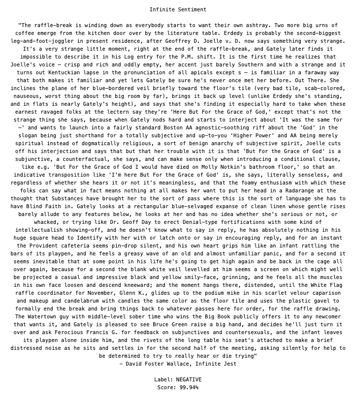

# Infinite Sentiment

## About:

I wanted to try out Hugging Face's Transformers.js ([https://huggingface.co/docs/transformers.js/index](https://huggingface.co/docs/transformers.js/index)) machine learning library on random quotes and I had a text file of Infinite Jest by David Foster Wallace, hence this Infinite Sentiment app which when run will display a random paragraph from Infinite Jest and then run Transformer's `Xenova/distilbert-base-uncased-finetuned-sst-2-english` text-classification model on the paragraph which provides a sentiment label and score for it.

Right now, on load the app parses the entirety of an Infinite Jest text file and then displays one random paragraph which it passes to Transformers.js library to await and then display the sentiment classification. In the future it would behoove me to add a button to pull other paragraphs from the already parsed text (indeed, it wouldn't be too hard to add additional, related functionality like scrolling through adjacent paragraphs, etc). However, as it stands right now, if you want to display a different random paragraph you can just refresh the page. Although it is a lot of text to parse, the time it takes is unnoticeable. It's actually the machine learning that takes some time as you'll see based on the loading text.  

## Running this app locally is easy:

This is a [Next.js](https://nextjs.org/) project.

First, run the development server:

```bash
npm run dev
# or
yarn dev
# or
pnpm dev
# or
bun dev
```

Second, open [http://localhost:3000](http://localhost:3000) with your browser to see the result.

That's it!

Note: this app runs entirely client-side and runs machine learning models right in the browser. The local Next.js server is only used to serve the client-side code.

## Sample pictures of the simple UI:



